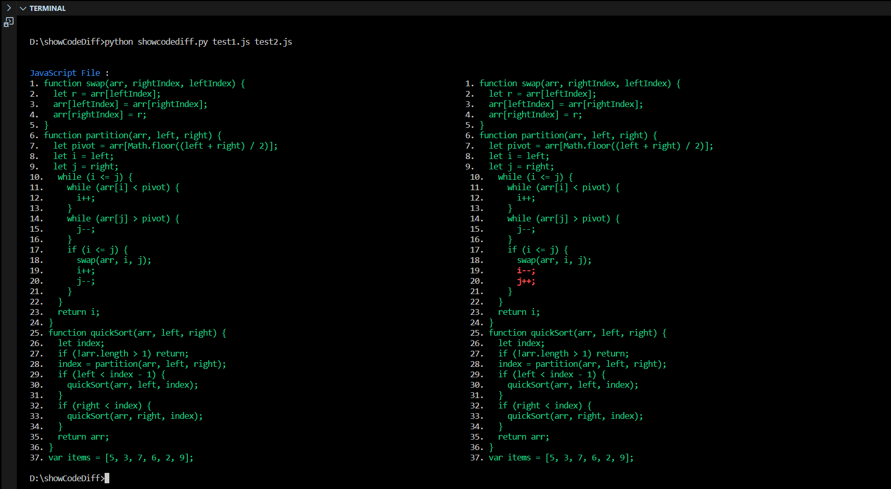

## About

ShowCodeDiff Is A Tool Used To Check 2 Files And Highlights The Difference Or Error. It Is Written In Python And Can Identify The File Extension



## Installation

```console
user@example:~git clone https://github.com/adhithyanmv/ShowCodeDiff.git
user@example:~cd ShowCodeDiff
user@example:~python showcodediff.py <file> <file2>
```
